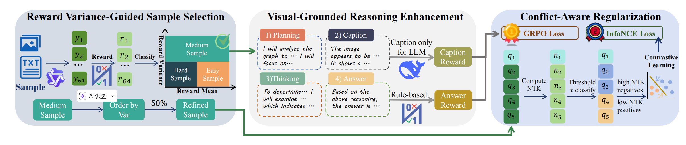

# Ground-What-You-See
Ground What You See: Hallucination-Resistant MLLMs via Caption Feedback, Diversity-Aware Sampling, and Conflict Regularization

## 👀 Introduction
Three types of illusions in the field of multimodal large models:


## 🧠 Method


## 🏆 Performance


## 📐 Set up
### 0. Environment
```bash
git clone https://github.com/tulerfeng/Video-R1
cd Ground-What-You-See

# build environment
conda create -n video-ground python=3.11 
conda activate video-ground
pip install -r requirements.txt
```
### 1. Dataset
1. Cold-Start Dataset:
* [Llava-COT](https://huggingface.co/datasets/Xkev/LLaVA-CoT-100k)
* [Llava-COT-modify-json](https://www.ug.link/dx4600pro-gwj/filemgr/share-download/?id=5ae9374b8b3d4a6cba50a13ec42b0258)
2. RL Dataset:
* [Video-R1-Data](https://huggingface.co/datasets/Video-R1/Video-R1-data)
* [Train_RL_Medium_24K.json](https://ug.link/dx4600pro-gwj/filemgr/share-download/?id=8bd9deb8224044dfb33595c7ef8f21f0)

